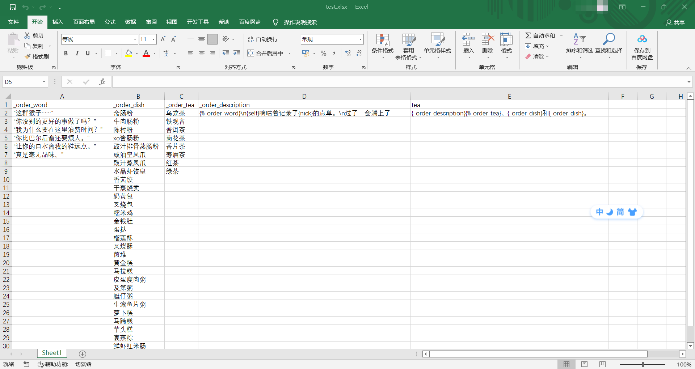
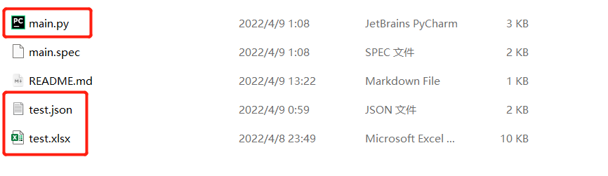
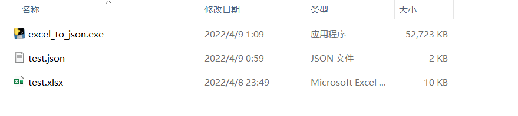
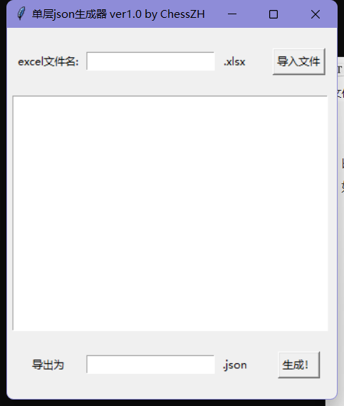
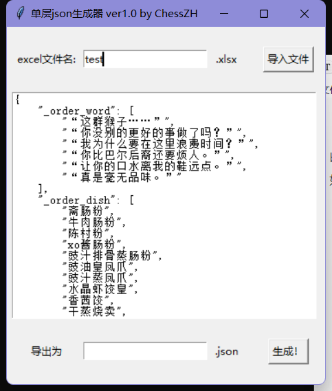
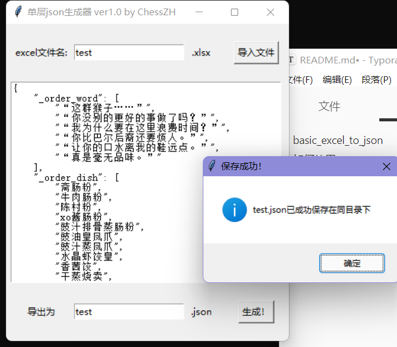
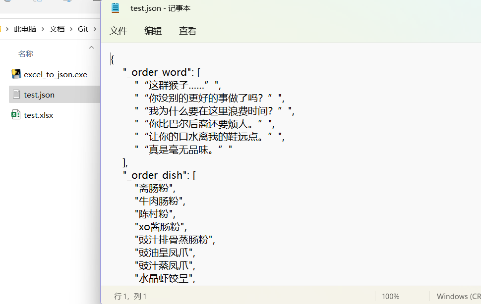

# basic_excel_to_json
基于tkinter的，仅支持单层嵌套的，简单excel转换为json的小工具

可执行文件在dist内

# 如何使用

## 1 Excel文档格式约定

如图所示，第一行为列表名（Dice内卡组名），每列分别为列表内容（卡组内容）。支持Dice式列表嵌套。例：test.xlsx

需要注意的是：目前只读取第一页的内容；文件后缀需为".xlsx"

## 2 文件位置

输入的xlsx需要放在py文件或exe文件的同目录下。生成的json文件也会出现在那里，如图所示：

使用py的情况：

使用exe的情况：

## 3 具体使用过程

打开软件（如使用exe，初次加载可能时间较长）

在上方输入框中输入需要读取的文件名，并点击“导入文件”

此时中间的编辑框内已经显示格式化好的json格式文本。你可以直接在里边进行微调

然后在下边的文本框中输入你想要生成的json文件名，点击“生成！”

回到目录可以看到这个json文件已经出现在exe的旁边了

# 其他

临时做的，界面比较简陋，如果用的人多会之后更新一些诸如文件浏览，格式控制的功能。如果对你有帮助或者喜欢这个项目的话请点个star吧！感谢！

https://github.com/ZhChessOvO/basic_excel_to_json
